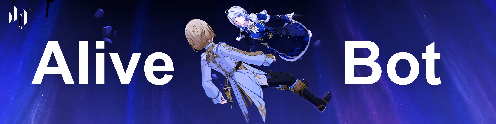

# AliveBot

AliveBot（灰眸）是一个 Rust 编写的基于 [nagisa](https://github.com/djkcyl/nagisa) 的 QQ **群聊**机器人。它通过 OneBot WebSocket 接收群消息，并调用 [llama.cpp](https://github.com/ggml-org/llama.cpp) 的 OpenAI-compatible API 生成回复。

**Bot 一定要 Alive。**AliveBot 支持丰富的消息形式，除普通消息外，还支持图片、QQ 表情、回复、戳一戳、贴表情、合并转发、表情包甚至语音转录，这使得只要模型足够强大，机器人的行为可以接近真人。

## 准备

- Cargo 和 Visual Studio C++ 构建工具、CMake、LLVM/libclang。

- 一个提供 WebSocket 地址的 OneBot 实现，推荐 [NapCatQQ]([NapNeko/NapCatQQ: Modern protocol-side framework based on NTQQ](https://github.com/NapNeko/NapCatQQ))。

- 一个 OpenAI-compatible API 服务，需要支持扩展接口 `POST /v1/chat/completions/input_tokens`（如 llama.cpp）

- （可选）一个可被编译器找到的 CUDA Toolkit。


## 入门

1. 启动 NapCatQQ（或其他 OneBot 实现）并登录 QQ 账号；
   配置一个无认证 token 的 WebSocket 服务器；
   建议端口：8080。（若选择其他端口，需要同时在 AliveBot 中配置 url）

2. 启动 llama.cpp（或其他符合要求的 OpenAI-compatible API 服务）
   [配置](#配置) openai_url、api_key 和模型相关参数。

3. 构建并启动 AliveBot，配置群聊白名单，创建空白的 `idmap` 和 `memes` 列表。

   ```powershell
   cargo run --release --bin AliveBot -- --group-whitelist 123456789
   ```

现在，您已经创建了一个最基础的~~可用~~的群聊机器人！它会接收群中的消息，并发送消息来回应。

#### [命令]

使用 `/` 开头即可发送命令。命令不会传给 LLM，而是执行一些固定操作。

- `/ping`：检查机器人是否在线
- `/new`：清空当前群的上下文
- `/face`：发送表情
- `/faceid`：查询表情 ID
- `/react`：给被回复的消息添加回应


## 配置

AliveBot 有如下参数可以进行配置。

| 参数名                | 类型         | 默认值                                          | 说明                                                         |
| --------------------- | ------------ | ----------------------------------------------- | ------------------------------------------------------------ |
| `--config`            | `'PathBuf'`  | `'config/config.toml'`                          | 指定配置文件路径                                             |
| `--ws-url`            | `'String'`   | `'ws://127.0.0.1:8080'`                         | OneBot WebSocket 地址                                        |
| `--openai-url`        | `'String'`   | `'http://127.0.0.1:8081/v1'`                    | LLM API 基础地址，末尾不要添加 `/`                           |
| `--api-key`           | `'String'`   | `''`                                            | API Key；为空时不发送认证请求头                              |
| `--model`, `-m`       | `'String'`   | `'qwen-3.8-27b'`                                | 请求使用的模型名称                                           |
| `--temperature`, `-t` | `'f32'`      | `'0.55'`                                        | 控制生成随机性                                               |
| `--top-p`             | `'f32'`      | `'0.8'`                                         | 核采样参数                                                   |
| `--top-k`             | `'u32'`      | `'20'`                                          | Top-K 采样参数                                               |
| `--repeat-penalty`    | `'f32'`      | `'1.05'`                                        | 重复内容惩罚系数                                             |
| `--max-tokens`        | `'u32'`      | `'32768'`                                       | 最大生成 token 数，同时用于上下文裁剪阈值                    |
| `--group-whitelist`   | `'Vec<i64>'` | `'[593883760]'`                                 | 群聊白名单；多个群号需要重复传入该参数                       |
| `--self-accounts`     | `'Vec<i64>'` | `'[1787552039, 3550036364]'`                    | 只加入上下文而不触发模型回复的账号                           |
| `--system-prompt`     | `'String'`   | `'你正在参加一个真实、持续运作的熟人QQ群聊...'` | 模型的系统提示词                                             |
| `--enable-transcript` | `'bool'`     | `'false'`                                       | 是否接收语音消息并转录。在启动时自动准备 FFmpeg 和 Whisper 模型 |

配置有两种方法：

1. 在启动程序时直接使用参数，优先级最高

2. 在 `config/config.toml` 中配置，参数名前缀横杠去掉，中间横杠变成下划线。


## 进阶

上述的机器人是一个**非常机器人的**机器人，一点也不 **Alive**，于是，我们可以开始搞点更高级的玩法。

#### [人格]

**可以用系统提示词为机器人设定人格**。相信你对此并不陌生！

不过默认提示词中存在很多重要的规则说明，因此建议在后面追加自己的提示词而不是替换。

#### [认识]

如何让冰冷的 uid 变成温暖的日常称呼？一张表搞定！

`config/idmap.csv` 中存储了 uid 和自定义名称的对应关系。**把你的朋友们都填入表格**（参考 `config/idmap_example.csv`），这样机器人即可“认识“他们，并解锁 @ 能力！

#### [自主权]

传统机器人只是一个有问必答的助手，但真正的人类既可以选择不说话，也可以选择连续说好几句话。

大胆开启 NapCatQQ 的上报自身消息的开关，即可解锁满血的自主发言机器人，还原人类聊天最真实的模式。

与此同时，AliveBot 把查看合并转发消息的自主权也交给了机器人，当它看到一个合并转发消息，可以自行选择是否展开消息。

#### [多模态聊天内容]

`config/faces.csv` 中存储了完整的 QQ 表情库，这给予了机器人巨大的情绪表达空间。而自定义表情同样是情绪表达的重要途径，**你可以在  `memes` 目录中放置表情包文件，并在 `config/memes.csv` 中填写名称与文件名对应关系**（参考示例 `config/memes_example`），然后在提示词中告知模型或直接训练模型，于是机器人就拥有了发送大表情包甚至图文混排的能力！

同时，AliveBot 重点支持了”贴表情“这一现代化的聊天模式，双击头像拍一拍也进行了支持，极大提高聊天的表现力。

这些还原真实人类的点睛之笔，如果准备训练模型，可以重点关注。

#### [语音转录]

此外，还可以配置并开启语音转录，以接收语音消息。

设置 `enable_transcript = true` 后，程序会在启动时自动下载 FFmpeg 和 Whisper 模型 `ggml-small-q5_1.bin`。模型保存在 `models/`，首次启动需要网络连接。

默认使用 CPU：

```bash
cargo run --release --bin AliveBot
```

使用 CUDA：

```bash
cargo run --release --features cuda --bin AliveBot
```

Cargo 只负责启用 CUDA feature，不会安装 CUDA Toolkit。**需要自行安装兼容的 CUDA 环境**。


## 项目状态

早期项目，功能不完善，仅为将创意落地。
