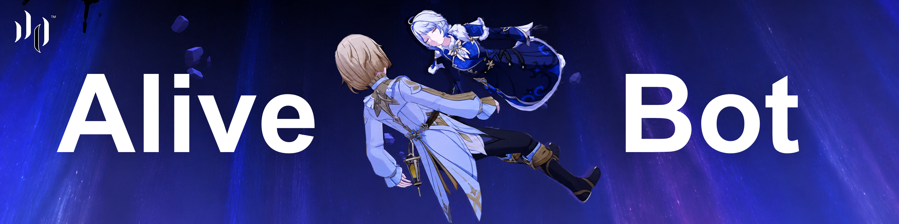

# AliveBot

AliveBot（灰眸）是一个 Rust 编写的基于 [nagisa](https://github.com/djkcyl/nagisa) 的 QQ **群聊**机器人。它通过 OneBot WebSocket 接收群消息，并通过 Codex CLI 的 app-server 生成回复和执行工具。Codex 服务、配置、认证和日志都位于 AliveBot 内，可独立运行；LLMServer 控制台只是可选的管理界面。

**Bot 一定要 Alive。**AliveBot 支持丰富的消息形式，除普通消息外，还支持图片 URL、QQ 内置表情、回复、戳一戳、贴表情、合并转发、独立群文件收发及语音转录，这使得只要模型足够强大，机器人的行为可以接近真人。

## 准备

- Cargo 和 Visual Studio C++ 构建工具、CMake、LLVM/libclang。

- 一个提供 WebSocket 地址的 OneBot 实现，推荐 [NapCatQQ](https://github.com/NapNeko/NapCatQQ)。

- Codex CLI（已验证 0.160.0）和 Node.js 22 或更新版本。机器人通过独立 `CODEX_HOME` 保存自己的配置、认证及会话；默认目录为 `codex-home/`。升级 CLI 后建议重新运行文末协议测试。

- （可选）一个可被编译器找到的 CUDA Toolkit。


## 入门

以下命令在 AliveBot 仓库根目录执行。配置复制命令仅用于首次安装；已有配置请直接编辑，避免覆盖。

1. 启动 OneBot 协议端并登录 QQ，配置正向 WebSocket 服务，消息格式使用数组，开启自身消息上报。默认地址为 `ws://127.0.0.1:8080`。当前程序未提供单独的 OneBot token 参数；使用无 token 的本机连接时，服务端应仅监听 `127.0.0.1`。

2. 创建三份本机配置：

   ```powershell
   Copy-Item config/config_example.toml config/config.toml
   Copy-Item codex-service/config.example.json codex-service/config.json
   New-Item -ItemType Directory -Force codex-home | Out-Null
   Copy-Item config/codex_runtime_example.toml codex-home/config.toml
   ```

   将 `config/config.toml` 的示例群号换成自己的白名单，填写 `system_prompt` 并选择账号可用的模型；`codex-service/config.json` 中的 `executable` 可以是 PATH 中的 `codex` 或 CLI 完整路径。不要省略主配置里的 `system_prompt`：文件模式会在投递前重新读取它。

3. 执行 `./Codex登录.ps1` 登录机器人专用 Codex 环境，再执行 `./启动Codex服务.ps1`。服务脚本在前台运行，保留这个进程；已有专用登录状态时无需重新登录。登录脚本使用固定的 `codex-home/`，若自行更改服务配置的 `home`，也需调整登录所用的 `CODEX_HOME`。

4. 在另一个终端中构建并运行机器人：

   ```powershell
   cargo build --release --target-dir target/codex
   ./target/codex/release/AliveBot.exe --config config/config.toml
   ```

每个群使用自己的工作区，初始化时创建 `memes/` 并复制 `config/faces.csv`。机器人只处理白名单群，私聊不处理；默认空闲时只有明确 @ 机器人才触发模型回复。

#### [命令]

以下命令在白名单群内使用。原命令文字不作为普通群消息传给模型；`/stop` 会另外写入停止任务的控制说明。

- `/ping`：检查机器人是否在线
- `/new`：停止旧会话的执行并新建 Codex 会话，保留工作目录文件
- `/stop`：停止当前任务，保留会话历史及工作目录
- `/face 14`：发送指定 ID 的 QQ 内置表情
- `/faceid` 后紧接一个实际的 QQ 内置表情：查询该表情 ID；不要发送表情名称文本
- 引用一条群消息，再发送 `/react 👍` 或 `/react` 后附 QQ 内置表情：给该消息添加回应；支持情况取决于协议端和表情类型


## 配置

下表是程序内置默认值，不是某个运行实例的配置。命令行布尔选项需显式填写 `true` 或 `false`，例如 `--fast-mode true`。

| 参数名                | 类型         | 默认值                                          | 说明                                                         |
| --------------------- | ------------ | ----------------------------------------------- | ------------------------------------------------------------ |
| `--config`            | `'PathBuf'`  | `'config/config.toml'`                          | 指定配置文件路径                                             |
| `--ws-url`            | `'String'`   | `'ws://127.0.0.1:8080'`                         | OneBot WebSocket 地址                                        |
| `--codex-url` | `String` | `http://127.0.0.1:4097` | AliveBot 自有 Codex 服务地址 |
| `--codex-token-file` | `PathBuf` | `codex-home/service-token.txt` | 本机服务认证；环境变量 `ALIVEBOT_CODEX_TOKEN` 优先 |
| `--workspace-dir` | `PathBuf` | `workspace` | 群工作目录根目录 |
| `--model`, `-m` | `String` | `gpt-6.1-sol` | Codex 模型 ID |
| `--reasoning-effort` | `String` | `high` | 推理强度；须由所选模型支持 |
| `--fast-mode` | `bool` | `false` | 每个新 turn 是否使用 Fast；false 明确使用普通速度；修改后重启 AliveBot |
| `--group-whitelist` | `Vec<i64>` | `[]` | 群白名单；空列表不处理任何群；多个群号重复传入该参数 |
| `--self-accounts` | `Vec<i64>` | `[]` | 列表内账号空闲时只记录，运行中仍以 steer 注入 |
| `--mention-only`      | `'bool'`     | `'true'`                                       | 仅被明确 @ 当前机器人账号时触发模型回复；false 恢复自动回复 |
| `--system-prompt`     | `'String'`   | `'你正在参加一个真实、持续运作的熟人QQ群聊...'` | 模型的系统提示词                                             |
| `--enable-transcript` | `'bool'`     | `'false'`                                       | 是否接收语音消息并转录。在启动时自动准备 FFmpeg 和 Whisper 模型 |

配置有两种方法：

1. 在启动程序时直接使用参数，优先级最高

2. 在 `config/config.toml` 中配置，参数名前缀横杠去掉，中间横杠变成下划线。

`mention_only` 默认为 `true`。空闲时未被 @ 的消息、贴表情和戳一戳仅记录；执行期间其他群友的新消息统一以 steer 注入。@全体不算明确 @ 机器人。自身判断仅依据 `self_accounts` 列表（默认 `[]`），不检查当前登录账号或平台 `is_self` 标记。列表内账号的消息和互动空闲时只记录，工作中与其他有效消息一样直接 steer；列表外账号均按普通群友处理。`mention_only = false` 时恢复普通消息及互动触发。已移除随机跳过、普通新消息导致的过期取消和 debug 控制台确认。


## 进阶

上述的机器人是一个**非常机器人的**机器人，一点也不 **Alive**，于是，我们可以开始搞点更高级的玩法。

#### [人格]

**可以用系统提示词为机器人设定人格**。相信你对此并不陌生！

`system_prompt` 会整体替换内置提示词，程序不会自动追加内置规则。可以重写人格和行为要求；若要让模型使用图片、文件、引用等动作，需要在自己的提示词或另行配置的规则文件里说明相应格式。

#### [认识]

用户识别统一使用 QQ 号（uin），无需配置姓名映射表。普通消息同时提供昵称/群名片和 uin，转发消息保留原作者昵称与 uin；收到的 @、贴表情和戳一戳中的用户目标使用数字 uin。

模型发送个人提及时使用 `@123456789 正文`（uin 后接空格或换行），戳一戳使用独立标签 `<nudge receiver:123456789>`。uin 必须是正整数；昵称不再解析为动作目标。`@全体成员` 保持原有行为。程序不再创建或读取旧用户映射文件；已有文件留在本地，不再生效。

#### [自主权]

传统机器人只是一个有问必答的助手，但真正的人类既可以选择不说话，也可以选择连续说好几句话。

保持 NapCatQQ 的自身消息上报开启。AliveBot 会按群、发送者和发送接口返回的 QQ 消息 ID，过滤模型发送的普通消息的重复上报，不再次加入上下文或唤醒模型；原 assistant 回复保留。同账号手动发送、其他程序发送的消息照常处理，并继续遵守 `mention_only` 和 `self_accounts`。每群持久化最近 4096 个模型发送 ID，重启及 `/new` 后仍保留；不按正文或时间猜测来源。贴表情、戳一戳无独立消息 ID，仍按原规则处理。发送超时、进程在保存 ID 前退出或没有返回可用 ID 时，无法保证过滤该条上报。

与此同时，AliveBot 把查看合并转发消息的自主权也交给了机器人，当它看到一个合并转发消息，可以自行选择是否展开消息。

#### [多模态聊天内容]

`config/faces.csv` 提供 QQ 内置表情的名称。群工作区初始化时会将它复制到工作区根目录的 `faces.csv`，供 Agent 直接读取；已有副本会保留。群图片以 `` 文本标记传给 Agent，保留完整地址与查询参数。AliveBot 不再预下载、压缩或转成 Base64 视觉附件；Agent 按需用命令行下载原文件，再用图片查看工具读取。URL 可能过期，下载失败时应如实说明。

每群使用 `workspace/<群号>/` 作为工作目录，并自动创建其中的 `memes/` 素材文件夹。目录中的图片由 Agent 通过命令行管理，若已另外接入知识库，名称和简介可记录到其中的表情区块。发送本地图片时使用 ``，例如 ``；路径基于当前群的 Agent 工作目录，文件必须真实存在且位于该目录内。它按普通图片发送，可以与文字混排。输入 URL 引用需先下载为本地文件，再通过相对路径发送。其他输出格式包括普通文字、QQ 内置表情、引用、@、贴表情、戳一戳和消息查询。

群文件以独立的 `<file path:原始URL, name:原文件名, size:字节数>` 消息传给 Agent；文件名和大小写在标签内，上传者 UIN 位于消息头。文件 ID 仅在程序内部使用；收到上传通知但没有 URL 时，通过 OneBot 查询群文件下载链接。Agent 按需下载并读取，失效链接的 path 标记为 unavailable，仍保留 name 和 size；文件名中的特殊字符使用 HTML 实体转义。文件内容不直接作为视觉附件注入。

发送文件时独立输出 `<file path:相对路径>`，例如 `<file path:files/报告.pdf>`，路径基于当前群的 Agent 工作目录。程序调用群文件上传接口，使用本地文件名；这不是图片消息段，不能与文字、图片、引用或其他动作混排。上传结果只写入日志，发送结果不明时不自动重试。返回文件 ID 时按文件 ID 和上传者过滤模型文件的重复上报，近期记录持久化并在 `/new` 后保留；接口没有返回文件 ID 时无法保证该过滤，不按文件名或时间猜测。

同时，AliveBot 重点支持了”贴表情“这一现代化的聊天模式，双击头像拍一拍也进行了支持，极大提高聊天的表现力。

这些还原真实人类的点睛之笔，如果准备训练模型，可以重点关注。

#### [语音转录]

此外，还可以配置并开启语音转录，以接收语音消息。

设置 `enable_transcript = true` 后，程序会在启动时自动下载 FFmpeg 和 Whisper 模型 `ggml-small-q5_1.bin`。模型保存在 `models/`，首次启动需要网络连接。

默认使用 CPU：

```bash
cargo run --release --bin AliveBot
```

使用 CUDA：

```bash
cargo run --release --features cuda --bin AliveBot
```

Cargo 只负责启用 CUDA feature，不会安装 CUDA Toolkit。**需要自行安装兼容的 CUDA 环境**。


## 项目状态

早期项目，功能不完善，仅为将创意落地。

## Codex 会话与运行状态

机器人专用目录 `codex-home` 保存配置、认证和 Codex 会话；`codex-service/config.json` 设置 CLI 路径、服务端口、工作区根目录。服务仅监听 127.0.0.1，需要随机生成的本机令牌。适配层只依赖 Node 标准库，启动 Codex app-server 的 stdio JSON-RPC，不依赖 LLMServer、OpenCode 服务、它们的密钥或数据库。

每群 `.alivebot/session.json` 保存 transport session ID、真实 `thread_id`、待投递消息、已处理消息和 QQ 发送去重状态；`.alivebot/codex` 保存用于恢复投递的本地日志，实际模型上下文由 Codex 自身持久保存。首次切换会备份旧状态为 `.alivebot/opencode-session.backup.json`，新建 Codex 会话并保留工作区素材与发送去重记录。不会再生成 `.opencode/opencode.json`。

空闲时，触发回复的消息启动 turn；其他消息通过 `thread/inject_items` 记录且不调用模型。工作中的所有有效消息，包括自身非模型消息，均以 `turn/steer` 追加当前轮。模型生成消息的 QQ 回传直接过滤。steer 和当前轮结束发生竞争时，重新核对状态，选择启动或只记录，不使用下一轮 queue。

过程说明与最终答复均可发送到 QQ，思考和工具输出不会直接作为 QQ 回复发送。AliveBot 的 `codex-home/alivebot/trace-日期.jsonl` 记录输入、主提示词、公开输出，以及适配层识别到的工具名称和状态，不包含工具参数或结果；它不是完整的工具执行记录，嵌套调用等过程可能不会逐项显示。

Codex 自己的会话文件和日志仍可能保存工具参数、结果及查看图片时产生的图片数据，不能把“简化日志不显示”理解成“整个系统不保存”。诊断标准错误另存 `codex-home/alivebot/app-server.stderr.log`。这些运行数据均不提交 Git。

使用文件提示词时，修改配置文件中的 `system_prompt` 无需重启。若启动时指定了 `--system-prompt`，该命令行值优先，文件修改不会被读取，需要调整启动参数并重启。下次空闲投递前，会卸载并恢复该 thread，重新应用主提示词。工作中修改会在下一轮生效，不中断正在执行的工具。模型、推理强度、运行目录等其他配置修改仍需重启相应服务。AliveBot 传入的主提示词来自上述选定来源；工作区内另行配置的指引、工具规则及 Codex 内置指令不属于这一字段。

输入图片仅保留 `` 文本；Agent 自行下载和查看。图片、文件发送仍限定当前群工作区内的路径。memory、gcsim 和“QQ 表情库”是本机部署中另行接入的能力，不包含在本仓库，也不会自动安装或注册为 Codex 工具。需要使用时，自行安装相应 CLI 并提供使用说明；它们不要求启动 OpenCode 服务。

确定已接受的消息不会重复提交；连接中断导致接受结果不明时，保留待投递状态并报错，避免盲目重复启动工具或发送。`/stop` 中断当前轮；`/new` 建立新会话，保留素材和回传过滤记录。

验证命令：

```powershell
cargo test --locked --bin AliveBot
node --test codex-service/bridge.test.mjs
python codex-service/check_protocol.py
```

最后一项需要 Python 3 和可执行的 Codex CLI（默认从 PATH 查找，也可设置 `CODEX_EXECUTABLE`）。它使用真实 CLI 和完全本地的模型替身，验证记录、steer、工具执行、提示词刷新及重启恢复，不调用付费模型，不连接 QQ。

## 协议端切换

AliveBot 通过 OneBot 11 正向 WebSocket 连接协议端，Codex、memory、gcsim 和 Yunzai 宿主相互独立。LLBot 提供对应的 OneBot 11 接口，但截至 2026-10-04，本机部署仍待 LLBot Auth Token 审核及端到端验证，不能将接口存在等同于全部功能已验证。

LLBot 连接应使用数组消息格式并开启 `reportSelfMessage`，以保留同账号非模型消息和模型回复去重。更换协议端后旧消息 ID 不保证仍可用于引用、撤回或表情回应；切换应在在途发送完成后进行。普通图片和文件目前使用协议端可读取的本地路径，同一 Windows 主机可继续使用，跨系统部署需要内容上传或路径映射。Yunzai 使用另一条连接，关闭自身消息上报以避免触发插件循环。
